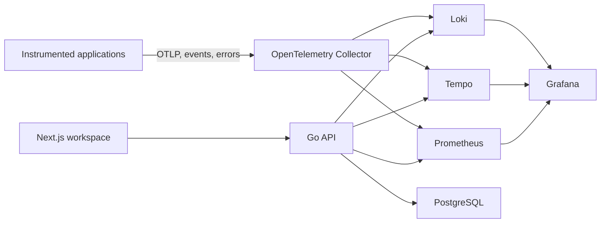

# PulseGuard

PulseGuard is a full-stack observability workspace for investigating application errors alongside the logs, metrics, sessions, and distributed traces that explain them.

[Live interface](https://pulseguard-phi.vercel.app)


## What it brings together

- Project and workspace management
- Application error capture and severity views
- Structured logs backed by Loki
- Metrics and time-series exploration backed by Prometheus
- Distributed trace inspection backed by Tempo
- Trace-to-log navigation
- Session and page-view telemetry
- Alert configuration
- Client and server OpenTelemetry instrumentation
- Authentication, invitations, and workspace-scoped access

## Architecture



The TypeScript application owns the product interface and browser telemetry. The Go API handles authentication, workspaces, projects, alerts, errors, and queries across the telemetry backends. PostgreSQL stores product state while Loki, Tempo, and Prometheus remain responsible for their respective telemetry domains.

## Repository map

```text
backend/
  cmd/server/               Go service entry point
  internal/api/             Routes, handlers, and middleware
  internal/repository/      PostgreSQL and telemetry adapters
  internal/service/         Product and aggregation logic
  pkg/otel/                 OpenTelemetry setup

src/
  app/                      Next.js routes and telemetry endpoints
  components/dashboard/     Errors, logs, metrics, traces, sessions, and settings
  lib/telemetry/             Client-side collection and instrumentation

grafana/provisioning/       Datasources and dashboards
docker-compose.yml          Local telemetry stack
```

## Stack

- Next.js, React, and TypeScript
- Go with Chi
- PostgreSQL
- OpenTelemetry Collector and SDKs
- Prometheus, Loki, Tempo, and Grafana
- Docker Compose
- Tailwind CSS and Recharts

## Run locally

Requirements: Node.js 20.9+, pnpm 11+, Go, Docker, and Docker Compose.

```bash
pnpm install
cp .env.example .env
docker compose up --build
pnpm dev
```

The local stack provisions the telemetry services used by the API. Review the environment example and backend documentation before exposing any service outside a local environment.

## Verify

```bash
pnpm lint
pnpm typecheck
pnpm build
```

The Go service can be checked independently from `backend`:

```bash
go test ./...
go vet ./...
```

## Project status

PulseGuard is an active product prototype and engineering reference, not a drop-in replacement for a managed production observability service. Production deployment still requires hardened tenancy, retention, rate limiting, secrets management, backups, alert delivery, and capacity planning.

## License

See the repository and backend license files.
