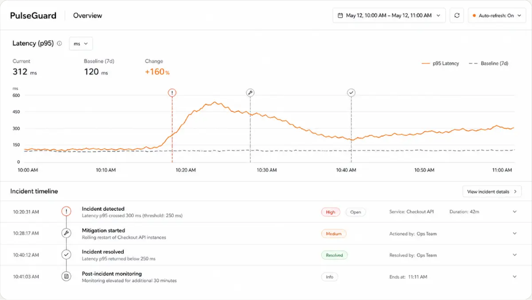

# PulseGuard

PulseGuard is a full-stack observability workspace for investigating application errors alongside the logs, metrics, sessions, and distributed traces that explain them.

- [Live interface](https://pulseguard-phi.vercel.app)
- [Marketing site repository](https://github.com/Vic-Orlands/pulseguard-site)

## What it brings together

- Project and workspace management
- Application error capture and severity views
- Structured logs backed by Loki
- Metrics and time-series exploration backed by Prometheus
- Distributed trace inspection backed by Tempo
- Trace-to-log navigation
- Session and page-view telemetry
- Alert configuration
- Client and server OpenTelemetry instrumentation
- Authentication, invitations, and workspace-scoped access
